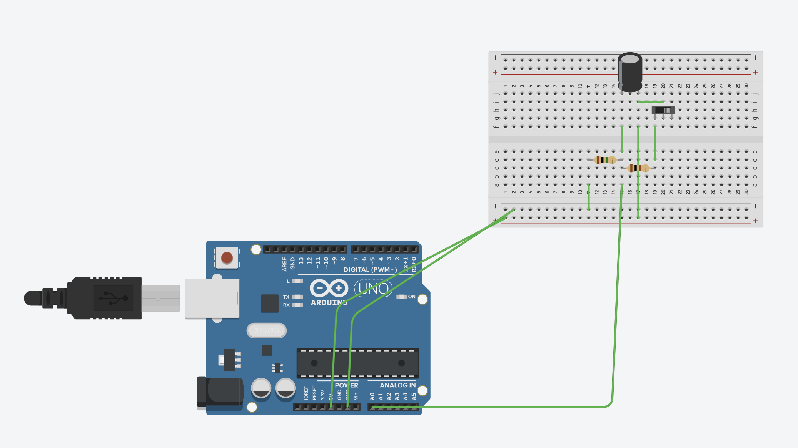
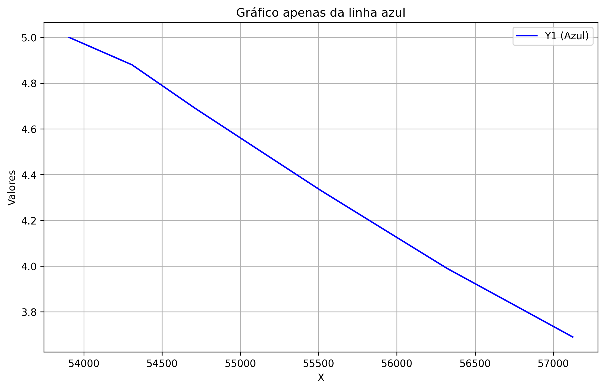
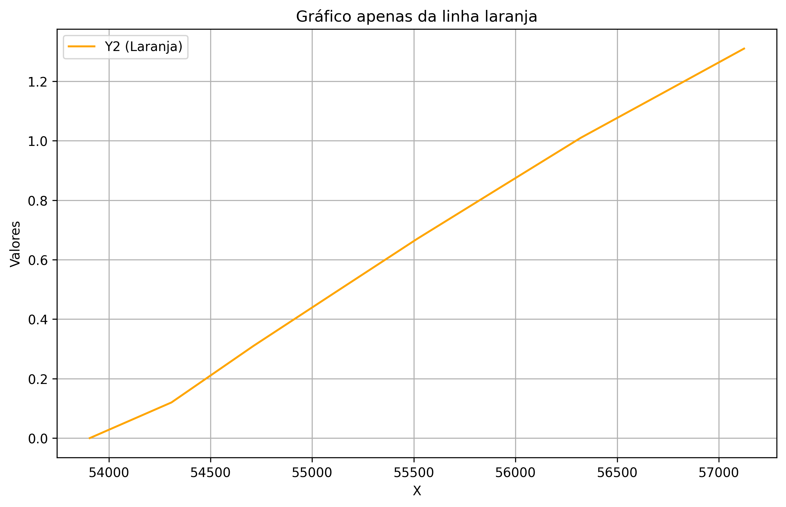
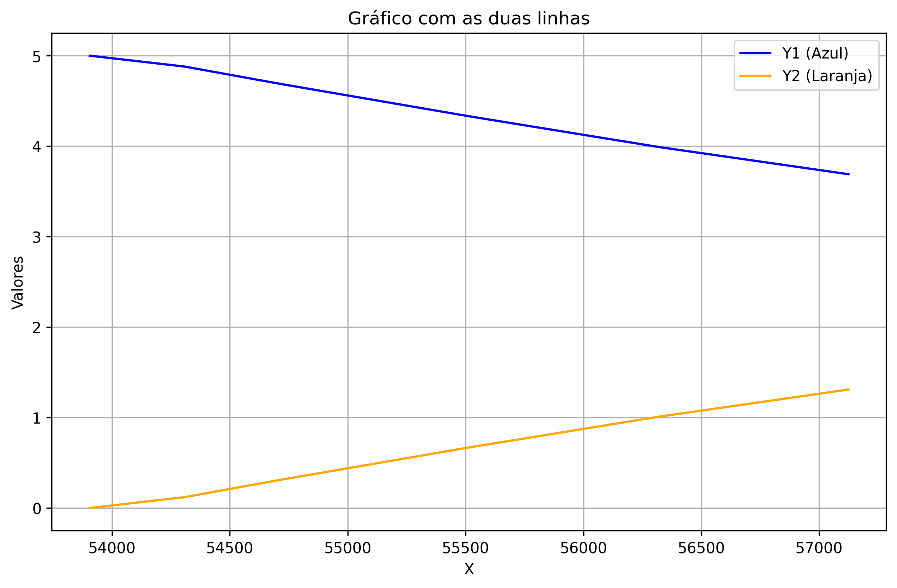

# Ponderada de Programação

## Simulando Carga de Capacitor e Descarga de Resistor

Para a simulação da carga do capacitor e descarga do resistor, foi utilizado o software Tinkercad, uma plataforma online para montagem e teste de circuitos eletrônicos. O circuito conta com um interruptor, dois resistores (1 MΩ e 100 Ω), um capacitor de 10 µF / 25 V, um microcontrolador Arduino UNO e um protoboard.

Durante a simulação, o interruptor é acionado manualmente pela plataforma. Em seguida, o capacitor inicia o processo de carga enquanto o resistor realiza a descarga. Durante esse período, o valor analógico é lido pelo Arduino na porta A0 e exibido no Monitor Serial.

Abaixo tem-se a imagem do circuito montado no Tinkercad:



Abaixo esta o link para o video do problema feito na mão: [https://drive.google.com/file/d/1Glu0VMJoAHf8UUe0F3EGorRK3EKyyjkv/view?usp=drive_link](https://drive.google.com/file/d/1Glu0VMJoAHf8UUe0F3EGorRK3EKyyjkv/view?usp=drive_link)

Código utilizado na simulação:

```
int pinoNoRC=0; 
int valorLido = 0;
float tensaoCapacitor = 0, tensaoResistor;
unsigned long time; 
void setup(){ 
Serial.begin(9600); 
} 
void loop() { 
	time=millis(); 
	valorLido=analogRead(pinoNoRC); 
	tensaoResistor=(valorLido*5.0/1023); // 5.0V / 1023 degraus = 0.0048876 
	tensaoCapacitor = abs(5.0-tensaoResistor);
 	Serial.print(time); //imprime o conteúdo de time no MONITOR SERIAL
    Serial.print(" "); 
  	Serial.print(tensaoResistor);
  	Serial.print(" ");
  	Serial.println(tensaoCapacitor); 
	delay(400); 
}
```

Alguns resultados Obtidos:
```
53906 5.00 0.00
54308 4.88 0.12
54711 4.69 0.31
55113 4.51 0.49
55516 4.33 0.67
```

Para facilitar a visualização dos dados coletados, foram gerados gráficos em Python utilizando os valores obtidos a partir do Monitor Serial.

Gráfico da Carga do Capacitor:



Gráfico da Descarga do Resistor:



Gráfico da comparação entre a Carga do Capacitor e a Descarga do Resistor:


